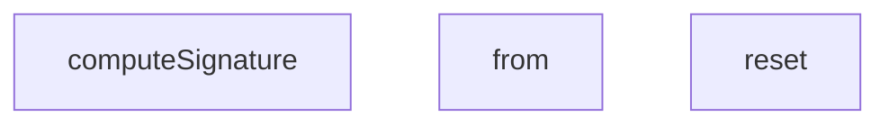

## Genel Bakış
Bu modül, webhook'ların uçtan uca (e2e) testlerini destekleyen yardımcı araçları içerir. Webhook isteklerinin imza doğrulamasını gerçekleştirmek için gerekli kriptografik hesaplamaları ve test senaryolarında veritabanı alışverişlerini simüle eden sahte bir veritabanı katmanını barındırır.

## Fonksiyon Grupları
### Webhook İmza Hesaplama
Gelen webhook isteklerinin HMAC-SHA256 imzasını hesaplayarak, üretim ortamındaki imza doğrulama mantığının test edilmesine olanak tanır.
- computeSignature

### Sahte Veritabanı Katmanı
Test senaryoları sırasında gerçek veritabanına bağımlılığı ortadan kaldırmak için tablo bazlı veri okuma ve sıfırlama işlemlerini simüle eder.
- WebhookMockDb sınıfının reset ve from metotları

---

## AXIOMS – Mimari Varsayımlar

Bu modül için özel aksiyom tanımlanmamıştır.

---

## FONKSİYON DETAYLARI

### computeSignature
**Ne yapar**: Bu fonksiyon, bir HMAC-SHA256 imzası hesaplar. Genellikle webhook'ların güvenliğini sağlamak için, gönderilen verilerin bütünlüğünü doğrulamak amacıyla kullanılır.
**Nasıl yapar**: Fonksiyon, gizli anahtarı (secret) ve gövde (body) metnini `TextEncoder` ile UTF-8 byte dizisine dönüştürür. Ardından Web Crypto API'sini (`globalThis.crypto.subtle`) kullanarak, HMAC-SHA256 algoritması için bir anahtar (key) import eder. Bu anahtar ile gövde üzerine bir imza (sign) işlemi uygulanır. Elde edilen imza byte dizisi, base64 formatına dönüştürülerek string olarak döndürülür. Bu süreç, kriptografik olarak güvenli bir imza üretmek için standart bir yöntemdir.
**Parametreler**:
- secret: string — HMAC imza hesaplamasında kullanılacak gizli anahtar. Genellikle webhook ayarlarında belirlenen paylaşımlı bir sırdır.
- body: string — İmzalanacak olan ham veri (payload). Genellikle JSON formatındaki webhook gövdesidir.
**Dönüş**: Promise<string> — Base64 kodlamalı HMAC-SHA256 imzasını temsil eden bir string. Bu değer, webhook isteklerinde `X-Signature` gibi bir başlık ile gönderilir.

### reset
**Ne yapar**: `WebhookMockDb` sınıfının (veya nesnesinin) içinde bulunduğu test ortamındaki tüm sipariş (`orders`) ve olay (`events`) verilerini temizler.
**Nasıl yapar**: Bu bir örnek (instance) metodudur. `this.orders` ve `this.events` adlı iki diziyi boş birer dizi (`[]`) ile değiştirerek, mock veritabanını başlangıç durumuna sıfırlar. Bu, her test senaryosundan önce veri kalıntısı olmasını önlemek ve testlerin birbirinden izole olmasını sağlamak için kullanılır.
**Parametreler**: Bu fonksiyon herhangi bir parametre almaz.
**Dönüş**: Yok (void). Fonksiyon doğrudan sınıfın iç durumunu (state) değiştirir ve bir değer döndürmez.

### from
**Ne yapar**: `WebhookMockDb` içindeki belirli bir tabloya (veri setine) karşılık gelen verileri sorgulamak, filtrelemek, güncellemek ve eklemek için zincirlenebilir (chainable) bir API arayüzü döndürür. Bu arayüz, Supabase veya benzeri kütüphanelerin sorgu yapma mantığını taklit eder.
**Nasıl yapar**: Fonksiyon, `table` parametresine göre iç veri setini seçer (`venthub_orders` ise `this.orders`, diğerleri ise `this.events`). Ardından, `select`, `eq`, `limit`, `update`, `single`, `insert` ve `then` metodlarını içeren bir zincir nesnesi (chain) döndürür. Bu metodlar, filtreleme sütunu/değeri (`filterColumn`, `filterValue`), sonuç limiti (`limitVal`) ve güncelleme nesnesi (`patchObject`) gibi iç durum değişkenlerini ayarlar. `single` ve `insert` asenkron olup `Promise<{ data: any; error: any }>` döndürürken, `then` metodu bir callback (`resolve`) çağırarak filtrelenmiş, limitlenmiş ve güncellenmiş sonuçları doğrudan sunar. Bu yapı, asenkron bir veritabanı isteğini simüle eder.
**Parametreler**:
- table: string — Sorgulanacak tablo adı. `'venthub_orders'` değeri siparişler dizisini, diğer değerler ise olaylar dizisini hedefler.
**Dönüş**: Bir zincir (chain) nesnesi. Bu nesne, aşağıdaki metodları içerir:
  - `select(fields?: string)`: Mevcut zinciri döndürür (bu uygulamada alan seçimi yapılmaz).
  - `eq(col: string, val: any)`: Filtreleme sütunu ve değerini ayarlar, zinciri döndürür.
  - `limit(l: number)`: Sonuç sayısını sınırlar, zinciri döndürür.
  - `update(patch: any)`: Güncellenecek alanları belirtir, zinciri döndürür.
  - `single()`: Promise<{ data: any; error: any }> — Tek bir satırı döndürür. Eşleşen kayıt yoksa `error` ile döner.
  - `insert(row: any)`: Promise<{ data: any; error: any }> — Yeni bir satır ekler ve eklenen satırı döndürür.
  - `then(resolve: any)`: void — Filtrelenmiş, limitlenmiş ve güncellenmiş sonuçları `resolve` callback'ine iletir. Bu, promise benzeri bir kullanım sağlar.

---

## İTHALATLAR (IMPORTS)
- import: ./helpers/denoRuntime::DenoRuntimeSimulator
- import: ./helpers/denoRuntime::setupDenoRuntime
- import: vitest::afterEach
- import: vitest::beforeEach
- import: vitest::describe
- import: vitest::expect
- import: vitest::it
- import: vitest::vi

---

## SABİTLER
- **mockDbInstance** (new_expression) — `new WebhookMockDb()`

---

## AST POINTERS

### [N1_NASIL] AST Pointer: tests/e2e/webhooks.test.ts::reset
- **params**: ()
- **ic_degiskenler**: yok
- **Dönüş**: yok — `this.orders` ve `this.events` dizilerini sıfırlar (class özelliklerini boş array yapar)

### [N2_NASIL] AST Pointer: tests/e2e/webhooks.test.ts::from
- **params**: (table: string)
- **ic_degiskenler**:
  - `dataset` — `table` parametresine göre `this.orders` veya `this.events` referansını atar
  - `filterColumn` — eq() ile ayarlanan filtreleme sütunu adı
  - `filterValue` — eq() ile ayarlanan filtreleme değeri
  - `limitVal` — limit() ile ayarlanan sonuç sayısı limiti
  - `patchObject` — update() ile ayarlanan güncelleme nesnesi
  - `chain` — zincirleme sorgu nesnesi (select, eq, limit, update, single, insert, then metodları)
- **Dönüş**: chain nesnesi (sorgu zincirleme nesnesi)

### [N3_NASIL] AST Pointer: tests/e2e/webhooks.test.ts::computeSignature
- **params**: (secret: string, body: string)
- **ic_degiskenler**:
  - `encoder` — TextEncoder instance (stringleri byte dizisine çevirir)
  - `key` — HMAC SHA-256 anahtarı (crypto.subtle.importKey ile oluşturulur)
  - `signature` — HMAC imzası ArrayBuffer (crypto.subtle.sign ile hesaplanır)
- **Dönüş**: Promise<string> — Base64 encoded imza

### [N4_NASIL] AST Pointer: tests/e2e/webhooks.test.ts::createClientFactory
- **params**: ()
- **ic_degiskenler**: yok
- **Dönüş**: `createClient` metodunu içeren nesne (mockDbInstance döndürür)

### [N5_NASIL] AST Pointer: tests/e2e/webhooks.test.ts::createClient
- **params**: ()
- **ic_degiskenler**: yok
- **Dönüş**: mockDbInstance (WebhookMockDb instance)

### [N6_NASIL] AST Pointer: tests/e2e/webhooks.test.ts::beforeEach
- **params**: ()
- **ic_degiskenler**:
  - `simulator` — DenoRuntimeSimulator instance (setupDenoRuntime ile oluşturulur, test ortamını başlatır)
- **Dönüş**: yok

### [N7_NASIL] AST Pointer: tests/e2e/webhooks.test.ts::afterEach
- **params**: ()
- **ic_degiskenler**: yok
- **Dönüş**: yok — simulator.cleanup() ve vi.restoreAllMocks() çağırır

### [N8_NASIL] AST Pointer: tests/e2e/webhooks.test.ts::test_update_order_to_shipped
- **params**: ()
- **ic_degiskenler**:
  - `payload` — Webhook isteği için JSON gövdesi (order_number, status, carrier, tracking_number)
  - `rawBody` — payload'ın string hali (JSON.stringify ile)
  - `signature` — computeSignature ile hesaplanan HMAC imzası
  - `req` — Request nesnesi (POST isteği, header'lar ile)
  - `res` — simulator.invokeFunction sonucu Response nesnesi
  - `resBody` — res.json() ile parse edilmiş yanıt gövdesi
- **Dönüş**: yok — status 200, order güncellenmiş olmalı

### [N9_NASIL] AST Pointer: tests/e2e/webhooks.test.ts::test_reject_invalid_signature
- **params**: ()
- **ic_degiskenler**:
  - `payload` — Webhook isteği için JSON gövdesi
  - `rawBody` — payload'ın string hali
  - `req` — Request nesnesi (geçersiz imza ile)
  - `res` — Response nesnesi
- **Dönüş**: yok — status 401 dönmeli

### [N10_NASIL] AST Pointer: tests/e2e/webhooks.test.ts::test_reject_expired_timestamp
- **params**: ()
- **ic_degiskenler**:
  - `payload` — Webhook isteği için JSON gövdesi
  - `rawBody` — payload'ın string hali
  - `signature` — geçerli HMAC imzası
  - `expiredTimestamp` — 10 dakika önceki timestamp (Date.now() - 600000)
  - `req` — Request nesnesi (süresi dolmuş timestamp ile)
  - `res` — Response nesnesi
  - `body` — parse edilmiş yanıt gövdesi
- **Dönüş**: yok — status 401, error "Stale or invalid timestamp"

### [N11_NASIL] AST Pointer: tests/e2e/webhooks.test.ts::getRealtimeChannel
- **params**: (tenantId: string)
- **ic_degiskenler**: yok
- **Dönüş**: string — `admin-orders-realtime-${tenantId}` formatında kanal adı

### [N12_NASIL] AST Pointer: tests/e2e/webhooks.test.ts::resolveInvoicePath
- **params**: (tenantId: string, invoiceId: string)
- **ic_degiskenler**: yok
- **Dönüş**: string — `tenants/${tenantId}/invoices/${invoiceId}.pdf` formatında yol veya hata fırlatır

### [N13_NASIL] AST Pointer: tests/e2e/webhooks.test.ts::test_tenant_context_rls
- **params**: ()
- **ic_degiskenler**:
  - `payload` — Webhook isteği için JSON gövdesi
  - `rawBody` — payload'ın string hali
  - `signature` — HMAC imzası
  - `req` — Request nesnesi
  - `originalFrom` — mockDbInstance.from metodunun orijinal referansı
  - `res` — Response nesnesi
- **Dönüş**: yok — tenant-a order güncellenmiş, tenant-b unchanged

### [N14_NASIL] AST Pointer: tests/e2e/webhooks.test.ts::mockFromOverride
- **params**: (table: string)
- **ic_degiskenler**:
  - `chain` — orijinal from().from() metodundan dönen zincir nesnesi
  - `originalSingle` — chain.single metodunun orijinal referansı
- **Dönüş**: chain nesnesi (RLS filtresi enjekte edilmiş)

### [N15_NASIL] AST Pointer: tests/e2e/webhooks.test.ts::rlsSingleOverride
- **params**: ()
- **ic_degiskenler**:
  - `res` — orijinal single() sonucu
  - `rows` — RLS filtresi uygulanmış order listesi (tenant_id='tenant-a')
- **Dönüş**: Promise<{data: any, error: any}> — filtrelenmiş tek satır veya orijinal sonuç

### [N16_NASIL] AST Pointer: tests/e2e/webhooks.test.ts::test_legacy_webhook_token
- **params**: ()
- **ic_degiskenler**:
  - `payload` — Webhook isteği için JSON gövdesi
  - `rawBody` — payload'ın string hali
  - `req` — Request nesnesi (x-webhook-token header ile)
  - `res` — Response nesnesi
- **Dönüş**: yok — status 200, order güncellenmiş

### [N17_NASIL] AST Pointer: tests/e2e/webhooks.test.ts::test_ignore_status_demotion
- **params**: ()
- **ic_degiskenler**:
  - `payload` — Webhook isteği için JSON gövdesi (durum düşürme denemesi)
  - `rawBody` — payload'ın string hali
  - `signature` — HMAC imzası
  - `req` — Request nesnesi
  - `res` — Response nesnesi
  - `body` — parse edilmiş yanıt gövdesi
- **Dönüş**: yok — status 200, unchanged=true, order durumu değişmemiş

### [N18_NASIL] AST Pointer: tests/e2e/webhooks.test.ts::test_missing_supabase_url
- **params**: ()
- **ic_degiskenler**:
  - `payload` — Webhook isteği için JSON gövdesi
  - `rawBody` — payload'ın string hali
  - `signature` — HMAC imzası
  - `req` — Request nesnesi
  - `res` — Response nesnesi
  - `body` — parse edilmiş yanıt gövdesi
- **Dönüş**: yok — status 500, error "missing SUPABASE_URL"

### [N19_NASIL] AST Pointer: tests/e2e/webhooks.test.ts::test_duplicate_event_id
- **params**: ()
- **ic_degiskenler**:
  - `payload` — Webhook isteği için JSON gövdesi
  - `rawBody` — payload'ın string hali
  - `signature` — HMAC imzası
  - `req` — Request nesnesi (x-id header ile)
  - `res` — Response nesnesi
  - `resBody` — parse edilmiş yanıt gövdesi
- **Dönüş**: yok — status 200, duplicate=true, unchanged=true, order güncellenmemiş

---

## MERMAID CALL GRAPH

## NODE ID STANDARD

  file: tests\e2e\webhooks.test.ts
  function: tests\e2e\webhooks.test.ts::computeSignature
  class: tests\e2e\webhooks.test.ts::WebhookMockDb

---

## DISA AKTARILANLAR (EXPORTS)
  export: WebhookMockDb
  export: computeSignature

---

## BILEŞIM (CONTAINS)
  contains: any[]