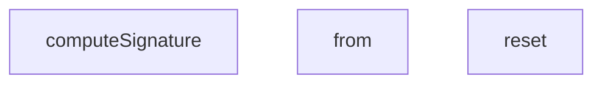

## Genel Bakış
Bu modül, webhook'ların uçtan uca (e2e) testlerini destekleyen yardımcı araçları içerir. Webhook isteklerinin imza doğrulamasını gerçekleştirmek için gerekli kriptografik hesaplamaları ve test senaryolarında veritabanı alışverişlerini simüle eden sahte bir veritabanı katmanını barındırır.

## Fonksiyon Grupları
### Webhook İmza Hesaplama
Gelen webhook isteklerinin HMAC-SHA256 imzasını hesaplayarak, üretim ortamındaki imza doğrulama mantığının test edilmesine olanak tanır.
- computeSignature

### Sahte Veritabanı Katmanı
Test senaryoları sırasında gerçek veritabanına bağımlılığı ortadan kaldırmak için tablo bazlı veri okuma ve sıfırlama işlemlerini simüle eder.
- WebhookMockDb sınıfının reset ve from metotları

---

## AXIOMS – Mimari Varsayımlar

Bu modül için özel aksiyom tanımlanmamıştır.

---

## FONKSİYON DETAYLARI

### computeSignature
**Ne yapar**: Verilen bir secret anahtarı ve HTTP gövde (body) içeriği kullanarak, HMAC-SHA256 algoritmasıyla bir imza (signature) hesaplar. Bu imza, webhook isteklerinin doğruluğunu ve bütünlüğünü doğrulamak için commonly kullanılır.

**Nasıl yapar**: Fonksiyon, `globalThis.crypto.subtle` API'sini kullanarak asenkron bir şekilde çalışır. Önce `TextEncoder` ile secret ve body dizelerini byte dizisine dönüştürür. Ardından `importKey` ile ham byte'lardan bir HMAC-SHA256 anahtarı oluşturur. Son olarak, bu anahtarla body üzerine bir `sign` işlemi yaparak imzayı üretir. Üretilen imza byte dizisi, `btoa` ile base64 encoded bir string'e dönüştürülerek sonuç döndürülür.

**Parametreler**:
- secret: string — HMAC imza hesaplamada kullanılacak gizli anahtar.
- body: string — İmzalanacak HTTP istek gövdesinin string temsili.

**Dönüş**: Promise<string> — Base64 formatında kodlanmış HMAC-SHA256 imza string'ini içeren bir Promise döner.

### reset
**Ne yapar**: `WebhookMockDb` sınıfının içindeki tüm test verilerini (siparişler ve olaylar) temizler. Her test senaryosundan önce veritabanını başlangıç durumuna sıfırlamak için kullanılır.

**Nasıl yapar**: `orders` ve `events` adlı iki dizi referansını doğrudan boş dizi (`[]`) ile yeniden atar. Bu sayede önceki testlerden kalan hiçbir veri bir sonraki test'e sızıntı yapmaz.

**Parametreler**:
- Parametre yoktur.

**Dönüş**: Return tipi belirtilmemiştir, herhangi bir değer dönmez (`void`).

### from
**Ne yapar**: Geliştirildi ancak detay üretilemedi.

---

## İTHALATLAR (IMPORTS)
- import: ./helpers/denoRuntime::DenoRuntimeSimulator
- import: ./helpers/denoRuntime::setupDenoRuntime
- import: vitest::afterEach
- import: vitest::beforeEach
- import: vitest::describe
- import: vitest::expect
- import: vitest::it
- import: vitest::vi

---

## SABİTLER
- **mockDbInstance** (new_expression) — `new WebhookMockDb()`

---

## AST POINTERS

### [N1_NASIL] AST Pointer: tests/e2e/webhooks.test.ts::WebhookMockDb.reset
- **params**: (yok — class method, `this` context)
- **ic_degiskenler**: (yok — doğrudan `this` alanlarını sıfırlar)
- **Dönüş**: yok (yan etki: `this.orders` ve `this.events` dizilerini boş diziye atar)

### [N2_NASIL] AST Pointer: tests/e2e/webhooks.test.ts::WebhookMockDb.from
- **params**: `table: string` — hangi tablonun (orders veya events) sorgulanacağını belirtir
- **ic_degiskenler**:
  - `dataset` — `table` parametresine göre `this.orders` veya `this.events` referansı; tüm sorgulama/insert/update bu dizi üzerine yapılır
  - `filterColumn` — `eq()` ile ayarlanan filtre sütun adı (ör. `order_number`); `single()` ve `then()` içinde `dataset.filter()` kullanılır
  - `filterValue` — `eq()` ile ayarlanan filtre değeri; `dataset.filter(r => r[filterColumn] === filterValue)` koşulunda kullanılır
  - `limitVal` — `limit()` ile ayarlanan makssat satır sayısı; `then()` içinde `filtered.slice(0, limitVal)` ile uygulanır
  - `patchObject` — `update()` ile verilen güncelleme nesnesi; `single()` ve `then()` içinde `Object.assign()` ile mevcut satırlara uygulanır
  - `chain` — fluent API zincir nesnesi; `select`, `eq`, `limit`, `update`, `single`, `insert`, `then` metodlarını barındırır
  - `chain.select` — (yöntem) fields parametresini alır, zinciri geri döner; filtreleme mantığından bağımsız passthrough
  - `chain.eq` — (yöntem) `col` ve `val` alarak `filterColumn`/`filterValue` set eder, zinciri geri döner
  - `chain.limit` — (yöntem) `l` parametresini `limitVal`'a yazar, zinciri geri döner
  - `chain.update` — (yöntem) `patch` parametresini `patchObject`'a atar, zinciri geri döner
  - `chain.single` — (async yöntem) `filterColumn`/`filterValue` ile filtrelenmiş ilk satırı döner; eşleşme yoksa `{ data: null, error: { message: 'Not found', code: 'PGRST116' } }` döner; `patchObject` varsa `Object.assign` ile uygular
  - `chain.insert` — (async yöntem) `row` parametresini `dataset`'e `push()` ile ekler, eklenen satırı `{ data: row, error: null }` olarak döner
  - `chain.then` — (yöntem, promise-like) `resolve` callback'ini çağırarak filtrelenmiş + limitlenmiş + patchlenmiş veriyi `{ data: sliced, error: null }` olarak resolve eder
  - `filtered` — `single()` ve `then()` içinde `filter()` sonucu oluşan eşleşen satırlar dizisi
  - `sliced` — `then()` içinde `limitVal > 0` koşuluyla `filtered.slice(0, limitVal)` ile elde edilen alt küme
- **Dönüş**: `chain` nesnesi (fluent API)

### [N3_NASIL] AST Pointer: tests/e2e/webhooks.test.ts::computeSignature
- **params**: `secret: string` — HMAC-SHA256 gizli anahtarı; `importKey` için ham byte'lara encode edilir; `body: string` — imzalanacak JSON gövde stringi
- **ic_degiskenler**:
  - `encoder` — `new TextEncoder()` instance'ı; `secret` ve `body`'yi `Uint8Array`'e çevirmek için kullanılır
  - `key` — `globalThis.crypto.subtle.importKey` ile oluşturulmuş CryptoKey; HMAC-SHA256 algoritmasıyla `secret`'ten türetilir; `sign()` metoduna girdi olarak verilir
  - `signature` — `globalThis.crypto.subtle.sign('HMAC', key, encoder.encode(body))` çağrısının base64'e çevrilmeden önceki ham `ArrayBuffer` sonucu
- **Dönüş**: `Promise<string>` — signature ArrayBuffer'ı `Uint8Array`'e çevirip `String.fromCharCode` ve `btoa` ile base64 string olarak döner

### [N4_NASIL] AST Pointer: tests/e2e/webhooks.test.ts::getRealtimeChannel
- **params**: `tenantId: string` — realtime kanal adının parçası olan tenant tanımlayıcısı
- **ic_degiskenler**:
  - `channelA` — `getRealtimeChannel('tenant-a')` çağrısı sonucu; beklenen değer `'admin-orders-realtime-tenant-a'`; test assertion'ları için kullanılır
  - `channelB` — `getRealtimeChannel('tenant-b')` çağrısı sonucu; beklenen değer `'admin-orders-realtime-tenant-b'`; `channelA` ile farklılık test edilir
- **Dönüş**: `string` — `` `admin-orders-realtime-${tenantId}` `` template literal; `tenantId` boşsa hata fırlatır

### [N5_NASIL] AST Pointer: tests/e2e/webhooks.test.ts::resolveInvoicePath
- **params**: `tenantId: string` — fatura yolunun tenant kısmını belirtir; regex ile `/[^a-zA-Z0-9\-]/` karakter kontrolü yapılır (path traversal koruması); `invoiceId: string` — fatura tanımlayıcısı, doğrudan path'e eklenir
- **ic_degiskenler**:
  - `pathA` — `resolveInvoicePath('tenant-a', 'INV-100')` çağrısı sonucu; beklenen değer `'tenants/tenant-a/invoices/INV-100.pdf'`; assertion için kullanılır
- **Dönüş**: `string` — `` `tenants/${tenantId}/invoices/${invoiceId}.pdf` `` template literal; `tenantId` boşsa veya regex eşleşmesi varsa `Error('Access Denied: Malformed tenant ID')` fırlatır

### [N6_NASIL] AST Pointer: tests/e2e/webhooks.test.ts::anonymous_beforeEach_callback
- **params**: (yok — Vitest beforeEach callback)
- **ic_degiskenler**:
  - `simulator` — `setupDenoRuntime` ile oluşturulan `DenoRuntimeSimulator` instance'ı; env değişkenleri (`SUPABASE_URL`, `SUPABASE_SERVICE_ROLE_KEY`, `SHIPPING_WEBHOOK_SECRET`, `SHIPPING_WEBHOOK_TOKEN`) ile yapılandırılır; test içinde `invokeFunction` ve `setEnv` için kullanılır
- **Dönüş**: yok (yan etki: `mockDbInstance.reset()` çağırır ve `simulator`'ı başlatır)

### [N7_NASIL] AST Pointer: tests/e2e/webhooks.test.ts::anonymous_afterEach_callback
- **params**: (yok — Vitest afterEach callback)
- **ic_degiskenler**: (yok)
- **Dönüş**: yok (yan etki: `simulator.cleanup()` ve `vi.restoreAllMocks()` çağırır — test izolasyonu sağlar)

### [N8_NASIL] AST Pointer: tests/e2e/webhooks.test.ts::test_happy_path_webhook_update
- **params**: (yok — Vitest `it` callback)
- **ic_degiskenler**:
  - `payload` — `{ order_number, status, carrier, tracking_number }` nesnesi; webhook'e gönderilecek güncelleme gövdesi
  - `rawBody` — `JSON.stringify(payload)` ile elde edilen string; hem imza hesaplamasında hem de `Request` body'sinde kullanılır
  - `signature` — `computeSignature('webhook-hmac-secret-12345', rawBody)` ile hesaplanmış HMAC-SHA256 base64 stringi; `x-signature` header'ına eklenir
  - `req` — `new Request(...)` nesnesi; method `POST`, headers: `x-timestamp`, `Content-Type: application/json`, `x-signature`; body: `rawBody`
  - `res` — `simulator.invokeFunction(webhookFunctionPath, req)` çağrısının response'u; `res.status === 200` ve `res.json()` kontrol edilir
  - `resBody` — `res.json()` promise'ının çözümü; `resBody.ok === true` assert edilir
- **Dönüş**: yok (yan etki: `mockDbInstance.orders[0]` alanlarının `status='shipped'`, `carrier='dhl'`, `tracking_number='DHL-123456789'` olduğunu doğrular)

### [N9_NASIL] AST Pointer: tests/e2e/webhooks.test.ts::test_invalid_signature_reject
- **params**: (yok — Vitest `it` callback)
- **ic_degiskenler**:
  - `payload` — `{ order_number: 'ORD-901', status: 'shipped' }` nesnesi; imzasız/yanlış imzalı istek gövdesi
  - `rawBody` — `JSON.stringify(payload)` sonucu string
  - `req` — `new Request(...)` nesnesi; `x-signature: 'invalid-hmac-signature'` header'ı ile oluşturulan hatalı imzalı istek
  - `res` — `simulator.invokeFunction` çağrısının response'u; `res.status === 401` assert edilir
- **Dönüş**: yok (yan etki: 401 HTTP status ile reddedildiğini doğrular)

### [N10_NASIL] AST Pointer: tests/e2e/webhooks.test.ts::test_stale_timestamp_reject
- **params**: (yok — Vitest `it` callback)
- **ic_degiskenler**:
  - `payload` — `{ order_number: 'ORD-901', status: 'shipped' }` nesnesi
  - `rawBody` — `JSON.stringify(payload)` sonucu string
  - `signature` — `computeSignature('webhook-hmac-secret-12345', rawBody)` ile hesaplanmış geçerli HMAC imzası
  - `expiredTimestamp` — `String(Date.now() - 10 * 60 * 1000)` ifadesiyle hesaplanmış 10 dakika eski timestamp stringi; replay guard testi için kullanılır
  - `req` — `new Request(...)` nesnesi; `x-signature` ve `x-timestamp` header'ları ile oluşturulmuş istek
  - `res` — `simulator.invokeFunction` çağrısının response'u; `res.status === 401` assert edilir
  - `body` — `res.json()` çözümü; `body.error === 'Stale or invalid timestamp'` assert edilir
- **Dönüş**: yok (yan etki: süresi dolmuş timestamp'in 401 ile reddedildiğini doğrular)

### [N11_NASIL] AST Pointer: tests/e2e/webhooks.test.ts::test_realtime_channel_isolation
- **params**: (yok — Vitest `it` callback)
- **ic_degiskenler**:
  - `channelA` — `getRealtimeChannel('tenant-a')` çağrısı sonucu; `'admin-orders-realtime-tenant-a'` olmalı
  - `channelB` — `getRealtimeChannel('tenant-b')` çağrısı sonucu; `'admin-orders-realtime-tenant-b'` olmalı
- **Dönüş**: yok (yan etki: iki farklı tenant'ın kanal isimlerinin farklı olduğunu doğrular)

### [N12_NASIL] AST Pointer: tests/e2e/webhooks.test.ts::test_resolve_invoice_path
- **params**: (yok — Vitest `it` callback)
- **ic_degiskenler**:
  - `pathA` — `resolveInvoicePath('tenant-a', 'INV-100')` çağrısı sonucu; `'tenants/tenant-a/invoices/INV-100.pdf'` olmalı
- **Dönüş**: yok (yan etki: path traversal girişiminin `Error('Access Denied')` ile engellendiğini doğrular)

### [N13_NASIL] AST Pointer: tests/e2e/webhooks.test.ts::test_tenant_isolation_with_rls
- **params**: (yok — Vitest `it` callback)
- **ic_degiskenler**:
  - `payload` — `{ order_number: 'ORD-COL-999', status: 'shipped' }` nesnesi; her iki tenant'ta da aynı order_number mevcut
  - `rawBody` — `JSON.stringify(payload)` sonucu
  - `signature` — `computeSignature('webhook-hmac-secret-12345', rawBody)` ile hesaplanmış HMAC imzası
  - `req` — `new Request(...)` nesnesi; geçerli imzalı webhook isteği
  - `originalFrom` — `mockDbInstance.from.bind(mockDbInstance)` ile saklanmış orijinal `from` metodu referansı; `finally` bloğunda geri yüklenir
  - `res` — `simulator.invokeFunction` çağrısının response'u; `res.status === 200` assert edilir
- **Dönüş**: yok (yan etki: RLS simülasyonu ile `order-a`'nın status'ü `'shipped'` olurken `order-b`'nin `'pending'` kaldığını doğrar; `finally` bloğunda `mockDbInstance.from` orijinaline geri yüklenir)

### [N14_NASIL] AST Pointer: tests/e2e/webhooks.test.ts::test_legacy_token_fallback
- **params**: (yok — Vitest `it` callback)
- **ic_degiskenler**:
  - `payload` — `{ order_number: 'ORD-SANDBOX', status: 'shipped' }` nesnesi
  - `rawBody` — `JSON.stringify(payload)` sonucu
  - `req` — `new Request(...)` nesnesi; HMAC imzası yerine `x-webhook-token: 'legacy-sandbox-token-555'` header'ı ile oluşturulmuş legacy fallback isteği
  - `res` — `simulator.invokeFunction` çağrısının response'u; `res.status === 200` assert edilir
- **Dönüş**: yok (yan etki: legacy token ile successful webhook processing'i ve `mockDbInstance.orders[0].status === 'shipped'` olduğunu doğrular)

### [N15_NASIL] AST Pointer: tests/e2e/webhooks.test.ts::test_status_demotion_blocked
- **params**: (yok — Vitest `it` callback)
- **ic_degiskenler**:
  - `payload` — `{ order_number: 'ORD-MONO', status: 'shipped' }` nesnesi; mevcut durumu `'delivered'` olan siparişi `'shipped'`'e düşürmeye çalışan demotion denemesi
  - `rawBody` — `JSON.stringify(payload)` sonucu
  - `signature` — `computeSignature('webhook-hmac-secret-12345', rawBody)` ile hesaplanmış HMAC imzası
  - `req` — `new Request(...)` nesnesi; geçerli imzalı demotion isteği
  - `res` — `simulator.invokeFunction` çağrısının response'u; `res.status === 200` assert edilir
  - `body` — `res.json()` çözümü; `body.unchanged === true` assert edilir
- **Dönüş**: yok (yan etki: sipariş status'ünün `'delivered'` olarak kaldığını, status düşürmenin engellendiğini doğrular)

### [N16_NASIL] AST Pointer: tests/e2e/webhooks.test.ts::test_missing_supabase_url_error
- **params**: (yok — Vitest `it` callback)
- **ic_degiskenler**:
  - `payload` — `{ order_number: 'ORD-901', status: 'shipped' }` nesnesi
  - `rawBody` — `JSON.stringify(payload)` sonucu
  - `signature` — `computeSignature('webhook-hmac-secret-12345', rawBody)` ile hesaplanmış HMAC imzası
  - `req` — `new Request(...)` nesnesi; `simulator.setEnv('SUPABASE_URL', '')` ile boşaltılmış env ile test edilen istek
  - `res` — `simulator.invokeFunction` çağrısının response'u; `res.status === 500` assert edilir
  - `body` — `res.json()` çözümü; `body.error`'nin `'missing SUPABASE_URL'` içerdiğini assert eder
- **Dönüş**: yok (yan etki: eksik env değişkeninin 500 ile handle edildiğini doğrular)

### [N17_NASIL] AST Pointer: tests/e2e/webhooks.test.ts::test_duplicate_event_prevention
- **params**: (yok — Vitest `it` callback)
- **ic_degiskenler**:
  - `payload` — `{ order_number: 'ORD-DUP', status: 'shipped' }` nesnesi
  - `rawBody` — `JSON.stringify(payload)` sonucu
  - `signature` — `computeSignature('webhook-hmac-secret-12345', rawBody)` ile hesaplanmış HMAC imzası
  - `req` — `new Request(...)` nesnesi; `x-id: 'EV-111222'` header'ı ile — önceden `mockDbInstance.events`'e eklenmiş duplicate event ID'si
  - `res` — `simulator.invokeFunction` çağrısının response'u; `res.status === 200` assert edilir
  - `resBody` — `res.json()` çözümü; `resBody.duplicate === true` ve `resBody.unchanged === true` assert edilir
- **Dönüş**: yok (yan etki: duplicate event ID ile sipariş durumunun değişmediğini (`'pending'` olarak kaldığını) ve `duplicate` flag döndüğünü doğrular)

### [N18_NASIL] AST Pointer: tests/e2e/webhooks.test.ts::test_tenant_id_derivation_from_order
- **params**: (yok — Vitest `it` callback)
- **ic_degiskenler**:
  - `ORDER_TENANT` — `'11111111-1111-1111-1111-111111111111'` sabit string; siparişin gerçek tenant_id'si
  - `ATTACKER_TENANT` — `'22222222-2222-2222-2222-222222222222'` sabit string; saldırganın payload'da belirttiği sahte tenant_id'si
  - `payload` — `{ order_number, status, tenant_id: ATTACKER_TENANT }` nesnesi; gövdeye saldırgan tenant_id'si enjekte edilmiş payload
  - `rawBody` — `JSON.stringify(payload)` sonucu
  - `signature` — `computeSignature('webhook-hmac-secret-12345', rawBody)` ile hesaplanmış HMAC imzası
  - `req` — `new Request(...)` nesnesi; URL query parameter'ında `tenant_id=${ATTACKER_TENANT}` ve `x-id: 'EV-DERIVE-1'` header'ı ile
  - `res` — `simulator.invokeFunction` çağrısının response'u; `res.status === 200` assert edilir
  - `event` — `mockDbInstance.events` dizisi üzerinde `find()` ile `event_id === 'EV-DERIVE-1'` koşuluyla aranan event satırı; `EventRow` interface'i ile tiplendirilmiş; `tenant_id` alanının `ORDER_TENANT` olduğunu assert eder
- **Dönüş**: yok (yan etki: saldırganın payload'da gönderdiği `tenant_id`'nin görmezden gelindiğini, webhook'in sipariş satırından (`ORDER_TENANT`) türettiği doğru tenant_id ile event kaydettiğini doğrular; `event?.tenant_id === ORDER_TENANT` ve `event?.tenant_id !== ATTACKER_TENANT` assertion'ları)

---

## MERMAID CALL GRAPH

## NODE ID STANDARD

  file: tests\e2e\webhooks.test.ts
  function: tests\e2e\webhooks.test.ts::computeSignature
  class: tests\e2e\webhooks.test.ts::WebhookMockDb

---

## DISA AKTARILANLAR (EXPORTS)
  export: WebhookMockDb
  export: computeSignature

---

## BILEŞIM (CONTAINS)
  contains: any[]