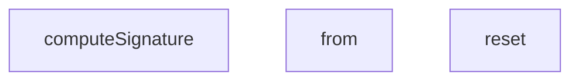

## Genel Bakış
Bu modül, webhook'ların uçtan uca (e2e) testlerini destekleyen yardımcı araçları içerir. Webhook isteklerinin imza doğrulamasını gerçekleştirmek için gerekli kriptografik hesaplamaları ve test senaryolarında veritabanı alışverişlerini simüle eden sahte bir veritabanı katmanını barındırır.

## Fonksiyon Grupları
### Webhook İmza Hesaplama
Gelen webhook isteklerinin HMAC-SHA256 imzasını hesaplayarak, üretim ortamındaki imza doğrulama mantığının test edilmesine olanak tanır.
- computeSignature

### Sahte Veritabanı Katmanı
Test senaryoları sırasında gerçek veritabanına bağımlılığı ortadan kaldırmak için tablo bazlı veri okuma ve sıfırlama işlemlerini simüle eder.
- WebhookMockDb sınıfının reset ve from metotları

---

## AXIOMS – Mimari Varsayımlar

Bu modül için özel aksiyom tanımlanmamıştır.

---

## FONKSİYON DETAYLARI

### computeSignature
**Ne yapar**: HMAC-SHA256 algoritmasını kullanarak verilen bir gövde (body) için kriptografik bir imza hesaplar.
**Nasıl yapar**: Web Crypto API'sini kullanarak gizli anahtarı (secret) raw formatında içe aktarır, HMAC-SHA256 ayarlarıyla bir CryptoKey nesnesi oluşturur. Ardından bu anahtarla gövdeyi imzalar ve elde edilen ikili imza verisini Base64 formatına dönüştürerek okunabilir bir metin dizesi olarak döndürür.
**Parametreler**:
- `secret`: string — HMAC imza hesaplamasında kullanılacak gizli anahtar.
- `body`: string — İmzası hesaplanacak olan HTTP isteği gövdesi veya veri.
**Dönüş**: `Promise<string>` — Hesaplanan HMAC-SHA256 imzasının Base64 ile kodlanmış hali.

### reset
**Ne yapar**: `WebhookMockDb` sınıfının tüm durumunu (siparişler ve olaylar) sıfırlar.
**Nasıl yapar**: Sınıf içinde tutulan `orders` ve `events` adlı iki dizi referansını, boş dizilerle (`[]`) değiştirerek tüm önceki verileri siler. Bu, her test senaryosu arasında izole bir başlangıç durumu sağlamak için kullanılır.
**Parametreler**: Bu fonksiyon herhangi bir parametre almaz.
**Dönüş**: Fonksiyon herhangi bir değer döndürmez (`void`).

### from
**Ne yapar**: Belirtilen bir tablo adı için bir sorgu zincirleme (query chain) nesnesi başlatır.
**Nasıl yapar**: Verilen `table` parametresine göre dahili `this.orders` veya `this.events` veri kümesini seçer. Ardından filtreleme (`eq`), güncelleme (`update`), ekleme (`insert`) ve sonuç alma (`single`, `then`) gibi Zincirleme (chainable) metodlar içeren bir nesne döndürür. Bu nesne, sonradan çağrılan metotlara göre filtreleme ve veri manipülasyonu için gerekli durumları (filterColumn, filterValue, patchObject vb.) kapanış (closure) aracılığıyla saklar.
**Parametreler**:
- `table`: string — Sorgulanacak tablonun adı. Yalnızca `'venthub_orders'` için siparişler kümesini, diğer tüm değerler için olaylar kümesini seçer.
**Dönüş**: `object` — `select`, `eq`, `limit`, `update`, `single`, `insert` ve `then` metodları içeren zincirleme sorgu nesnesi.

---

## SABİTLER
- **mockDbInstance** (new_expression) — `new WebhookMockDb()`

---

## AST POINTERS

### [N1_NASIL] AST Pointer: tests/e2e/webhooks.test.ts::WebhookMockDb::reset
- **params**: ()
- **ic_degiskenler**: (yok)
- **Dönüş**: void
- **Etki**: `this.orders` ve `this.events` array'lerini sıfırlar

### [N2_NASIL] AST Pointer: tests/e2e/webhooks.test.ts::WebhookMockDb::from
- **params**: (table: string)
- **ic_degiskenler**:
  - `dataset` — Tablo adına göre `this.orders` veya `this.events` array'ini referans olarak alan değişken
  - `filterColumn` — eq ile ayarlanan filtre sütun adını tutar (varsayılan: boş string)
  - `filterValue` — eq ile ayarlanan filtre değerini tutar (varsayılan: null)
  - `limitVal` — limit ile ayarlanan maksimum sonuç sayısını tutar (varsayılan: 0)
  - `patchObject` — update ile ayarlanan güncelleme nesnesini tutar (varsayılan: null)
  - `chain` — Zincirleme metodları (select, eq, limit, update, single, insert, then) barındıran nesne
- **Dönüş**: chain nesnesi

### [N3_NASIL] AST Pointer: tests/e2e/webhooks.test.ts::computeSignature
- **params**: (secret: string, body: string)
- **ic_degiskenler**:
  - `encoder` — Metinleri byte dizisine çeviren TextEncoder örneği
  - `key` — HMAC-SHA256 için import edilmiş CryptoKey örneği
  - `signature` — HMAC imzasının ArrayBuffer olarak ham hali
- **Dönüş**: Promise<string> (base64 encode edilmiş imza stringi)

### [N4_NASIL] AST Pointer: tests/e2e/webhooks.test.ts::getRealtimeChannel
- **params**: (tenantId: string)
- **ic_degiskenler**: (yok)
- **Dönüş**: string (realtime kanal adı)

### [N5_NASIL] AST Pointer: tests/e2e/webhooks.test.ts::resolveInvoicePath
- **params**: (tenantId: string, invoiceId: string)
- **ic_degiskenler**: (yok)
- **Dönüş**: string (fatura dosya yolu)

### [N6_NASIL] AST Pointer: tests/e2e/webhooks.test.ts::beforeEach_callback
- **params**: ()
- **ic_degiskenler**:
  - `simulator` — Deno runtime simülatörünü temsil eden DenoRuntimeSimulator örneği
- **Dönüş**: void

### [N7_NASIL] AST Pointer: tests/e2e/webhooks.test.ts::afterEach_callback
- **params**: ()
- **ic_degiskenler**: (yok)
- **Dönüş**: void

### [N8_NASIL] AST Pointer: tests/e2e/webhooks.test.ts::test_1_callback
- **params**: ()
- **ic_degiskenler**:
  - `payload` — Webhook için sipariş güncelleme verilerini içeren nesne
  - `rawBody` — payload'ın JSON string hali
  - `signature` — HMAC-SHA256 ile hesaplanmış imza stringi
  - `req` — Webhook fonksiyonuna gönderilecek Request nesnesi
  - `res` — Simulator'den dönen Response nesnesi
  - `resBody` — Response'un JSON parsed gövdesi
- **Dönüş**: Promise<void>

### [N9_NASIL] AST Pointer: tests/e2e/webhooks.test.ts::test_2_callback
- **params**: ()
- **ic_degiskenler**:
  - `payload` — Geçersiz imza ile gönderilecek sipariş verisi
  - `rawBody` — payload'ın JSON string hali
  - `req` — Geçersiz x-signature header'ı ile Request nesnesi
  - `res` — Simulator'den dönen Response nesnesi (beklenen: 401)
- **Dönüş**: Promise<void>

### [N10_NASIL] AST Pointer: tests/e2e/webhooks.test.ts::test_3_callback
- **params**: ()
- **ic_degiskenler**:
  - `payload` — Sipariş güncelleme verisi
  - `rawBody` — payload'ın JSON string hali
  - `signature` — Geçerli HMAC-SHA256 imzası
  - `expiredTimestamp` — 10 dakika önceki zaman damgası stringi
  - `req` — Süresi geçmiş timestamp ile Request nesnesi
  - `res` — Simulator'den dönen Response nesnesi (beklenen: 401)
  - `resBody` — Response'un JSON parsed gövdesi (error mesajı kontrolü)
- **Dönüş**: Promise<void>

### [N11_NASIL] AST Pointer: tests/e2e/webhooks.test.ts::test_4_callback
- **params**: ()
- **ic_degiskenler**:
  - `channelA` — Tenant A için realtime kanal adı
  - `channelB` — Tenant B için realtime kanal adı
- **Dönüş**: void

### [N12_NASIL] AST Pointer: tests/e2e/webhooks.test.ts::test_5_callback
- **params**: ()
- **ic_degiskenler**:
  - `pathA` — Tenant A için fatura dosya yolu
- **Dönüş**: void

### [N13_NASIL] AST Pointer: tests/e2e/webhooks.test.ts::test_6_callback
- **params**: ()
- **ic_degiskenler**:
  - `order_a` — Tenant A'ya ait sipariş nesnesi (push ile eklenir)
  - `order_b` — Tenant B'ye ait sipariş nesnesi (push ile eklenir)
  - `payload` — Sipariş güncelleme verisi
  - `rawBody` — payload'ın JSON string hali
  - `signature` — Geçerli HMAC-SHA256 imzası
  - `originalFrom` — Orijinal mockDbInstance.from fonksiyonunun referansı
  - `req` — Webhook Request nesnesi
  - `res` — Simulator'den dönen Response nesnesi
- **Dönüş**: Promise<void>

### [N14_NASIL] AST Pointer: tests/e2e/webhooks.test.ts::test_7_callback
- **params**: ()
- **ic_degiskenler**:
  - `payload` — Legacy sandbox token ile gönderilecek sipariş verisi
  - `rawBody` — payload'ın JSON string hali
  - `req` — x-webhook-token header'ı ile Request nesnesi
  - `res` — Simulator'den dönen Response nesnesi (beklenen: 200)
- **Dönüş**: Promise<void>

### [N15_NASIL] AST Pointer: tests/e2e/webhooks.test.ts::test_8_callback
- **params**: ()
- **ic_degiskenler**:
  - `payload` — Durum düşürme denemesi yapan sipariş verisi
  - `rawBody` — payload'ın JSON string hali
  - `signature` — Geçerli HMAC-SHA256 imzası
  - `req` — Webhook Request nesnesi
  - `res` — Simulator'den dönen Response nesnesi
  - `body` — Response'un JSON parsed gövdesi (unchanged flag kontrolü)
- **Dönüş**: Promise<void>

### [N16_NASIL] AST Pointer: tests/e2e/webhooks.test.ts::test_9_callback
- **params**: ()
- **ic_degiskenler**:
  - `payload` — Sipariş güncelleme verisi
  - `rawBody` — payload'ın JSON string hali
  - `signature` — Geçerli HMAC-SHA256 imzası
  - `req` — Webhook Request nesnesi
  - `res` — Simulator'den dönen Response nesnesi (beklenen: 500)
  - `body` — Response'un JSON parsed gövdesi (hata mesajı kontrolü)
- **Dönüş**: Promise<void>

### [N17_NASIL] AST Pointer: tests/e2e/webhooks.test.ts::test_10_callback
- **params**: ()
- **ic_degiskenler**:
  - `payload` — Sipariş güncelleme verisi
  - `rawBody` — payload'ın JSON string hali
  - `signature` — Geçerli HMAC-SHA256 imzası
  - `req` — x-id header'ı ile (tekrarlanan event ID) Request nesnesi
  - `res` — Simulator'den dönen Response nesnesi (beklenen: 200)
  - `resBody` — Response'un JSON parsed gövdesi (duplicate ve unchanged flag kontrolü)
- **Dönüş**: Promise<void>

### [N18_NASIL] AST Pointer: tests/e2e/webhooks.test.ts::chain_arrow_callbacks
- **params**: (anonim)
- **ic_degiskenler**:
  - `chain` — Zincirleme metodları barındıran nesne (select, eq, limit, update, single, insert, then)
  - `select` arrow callback — zincirleme için select metodunu temsil eder
  - `eq` arrow callback — zincirleme için eq metodunu temsil eder
  - `limit` arrow callback — zincirleme için limit metodunu temsil eder
  - `update` arrow callback — zincirleme için update metodunu temsil eder
  - `single` async arrow callback — zincirleme için single metodunu temsil eder
  - `insert` async arrow callback — zincirleme için insert metodunu temsil eder
  - `then` arrow callback — promise çözümleme için then metodunu temsil eder
- **Dönüş**: chain nesnesi (select, eq, limit, update, single, insert, then metodlarıyla)

---

## MERMAID CALL GRAPH

## NODE ID STANDARD

  file: tests\e2e\webhooks.test.ts
  function: tests\e2e\webhooks.test.ts::computeSignature
  class: tests\e2e\webhooks.test.ts::WebhookMockDb

---

## DISA AKTARILANLAR (EXPORTS)
  export: WebhookMockDb
  export: computeSignature

---

## BILEŞIM (CONTAINS)
  contains: any[]